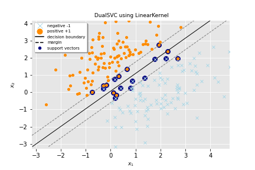
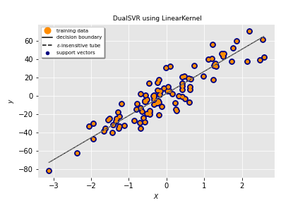
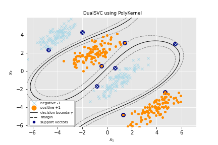
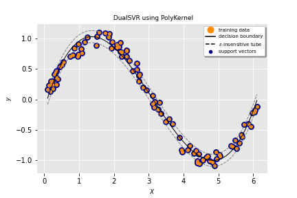
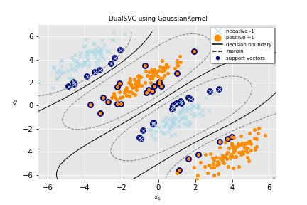
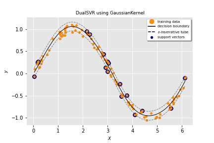

# OptiML
[](https://travis-ci.com/dmeoli/optiml) 
[](https://coveralls.io/github/dmeoli/optiml?branch=master) 
[](https://img.shields.io/badge/python-3.6%20%7C%203.7%20%7C%203.8%20%7C%203.9-blue) 
[](https://pypi.org/project/optiml/)
[](https://mybinder.org/v2/gh/dmeoli/optiml/master)

OptiML is a sklearn compatible implementation of *Support Vector Machines* and *Deep Neural Networks*, 
both with some of the most successful features according to the state of art.

This work was motivated by the possibility of being able to solve the optimization problem deriving from the mathematical 
formulation of these models through a wide range of optimization algorithms object of study and developed for the 
Numerical Methods and Optimization course  @ [Department of Computer Science](https://www.di.unipi.it/en/) @ 
[University of Pisa](https://www.unipi.it/index.php/english) under the supervision of prof. [Antonio Frangioni](http://pages.di.unipi.it/frangio/).

## Contents

- Numerical Optimization
    - Unconstrained Optimization
        - Line Search Methods
            - 0th Order Methods
                - [x] Subgradient
            - 1st Order Methods
                - [x] Steepest Gradient Descent
                - [x] Conjugate Gradient
                    - [x] Fletcher–Reeves formula
                    - [x] Polak–Ribière formula
                    - [x] Hestenes-Stiefel formula
                    - [x] Dai-Yuan formula
                - [x] Heavy Ball Gradient
            - 2nd Order Methods
                - [x] Newton
                - Quasi-Newton
                    - [x] BFGS
                    - [ ] L-BFGS
        - Stochastic Methods
            - [x] Stochastic Gradient Descent
                - [x] Momentum
                    - [x] standard
                    - [x] Nesterov
            - [x] Adam
                - [x] Momentum
                    - [x] standard
                    - [x] Nesterov
            - [x] AMSGrad
                - [x] Momentum
                    - [x] standard
                    - [x] Nesterov
            - [x] AdaMax
                - [x] Momentum
                    - [x] standard
                    - [x] Nesterov
            - [x] AdaGrad
            - [x] AdaDelta
            - [x] RProp
            - [x] RMSProp
                - [x] Momentum
                    - [x] standard
                    - [x] Nesterov
        - [x] Proximal Bundle with [cvxpy](https://github.com/cvxgrp/cvxpy) interface to 
          [ecos](https://github.com/embotech/ecos), [osqp](https://github.com/oxfordcontrol/osqp), 
          [scs](https://github.com/cvxgrp/scs), [etc](https://www.cvxpy.org/tutorial/advanced/index.html#choosing-a-solver).
    - Box-Constrained Quadratic Optimization
        - [x] Projected Gradient
        - [x] Frank-Wolfe or Conditional Gradient
        - [x] Active Set
        - [x] Interior Point
        - [x] Lagrangian Dual

- Machine Learning
    - [x] Support Vector Machines
        - Formulations
            - Primal
            - Wolfe Dual
            - Lagrangian Dual
        - [x] Support Vector Classifier
            - Losses
                - [x] Hinge (L1 Loss)
                - [x] Squared Hinge (L2 Loss)                            
        - [x] Support Vector Regression
            - Losses
                - [x] Epsilon-Insensitive (L1 Loss)
                - [x] Squared Epsilon-Insensitive (L2 Loss)
        - Kernels
            - [x] Linear
            - [x] Polynomial
            - [x] Gaussian
            - [x] Sigmoid
        - Optimizers (ad hoc)
            - [x] Sequential Minimal Optimization
            - [x] QP solver with [qpsolvers](https://github.com/stephane-caron/qpsolvers) interface to 
            [cvxopt](https://github.com/cvxopt/cvxopt), [quadprog](https://github.com/rmcgibbo/quadprog), 
            [qpOASES](https://github.com/coin-or/qpOASES), [etc](https://github.com/stephane-caron/qpsolvers#solvers).
    
    &NewLine;
              
    | SVC          | SVR          |
    |    :----:    |    :----:    |
    | Linear kernel     | Linear kernel     |
    |    |    |
    | Polynomial kernel | Polynomial kernel |
    |      |      |
    | Gaussian kernel   | Gaussian kernel   |
    |  |  |

    - [x] Neural Networks
        - [x] Neural Network Classifier
        - [x] Neural Network Regressor
        - Losses
            - [x] Mean Absolute Error (L1 Loss)
            - [x] Mean Squared Error (L2 Loss)
            - [x] Binary Cross Entropy
            - [x] Categorical Cross Entropy
            - [x] Sparse Categorical Cross Entropy
        - Regularizers
            - [x] L1 or Lasso
            - [x] L2 or Ridge or Tikhonov
        - Activations
            - [x] Linear
            - [x] Sigmoid
            - [x] Tanh
            - [x] ReLU
            - [x] SoftMax
        - Layers
            - [x] Fully Connected
        - Initializers
            - [x] Xavier or Glorot normal and uniform
            - [x] He normal and uniform

## Install

```
pip install optiml
```

## Contribution

Any bug report, bug fix or new pull request will be appreciated, especially from my classmates who will have the 
opportunity to deal with some of these algorithms and could be improving their performance or adding new features.

## License [](https://opensource.org/licenses/MIT)

This software is released under the MIT License. See the [LICENSE](LICENSE) file for details.
