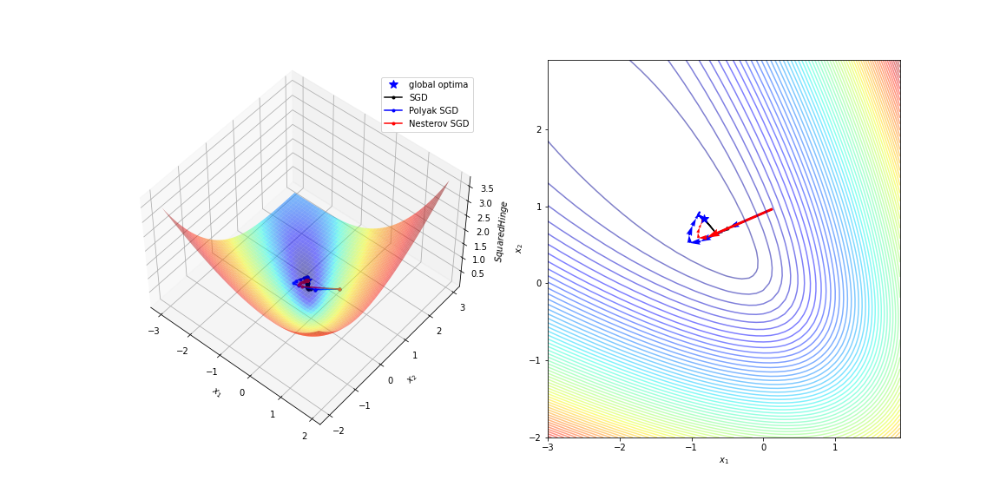
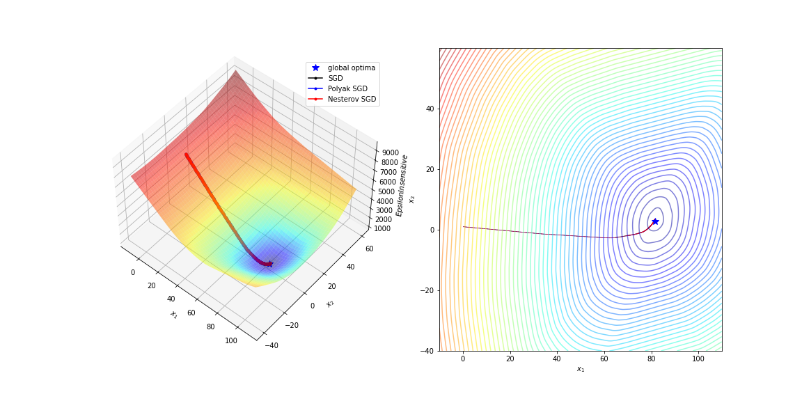
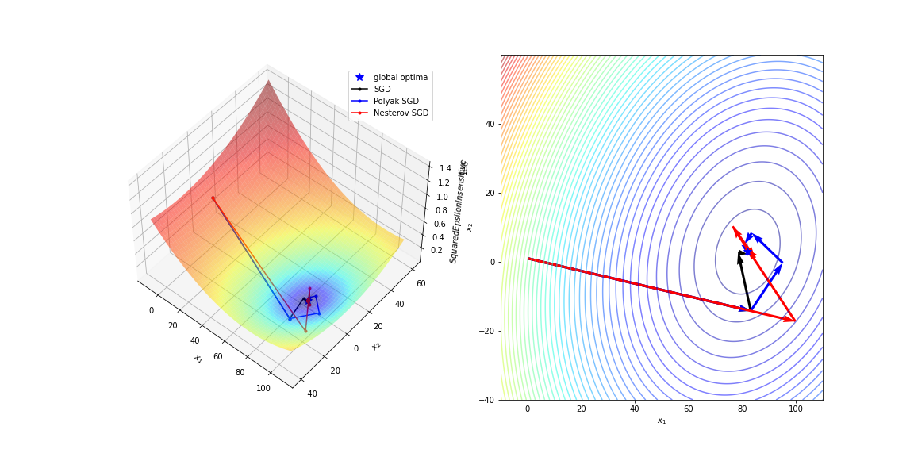
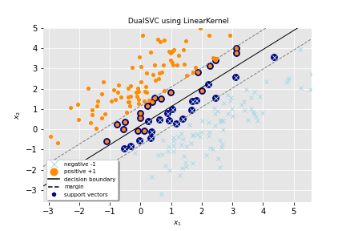
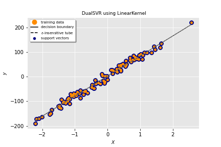
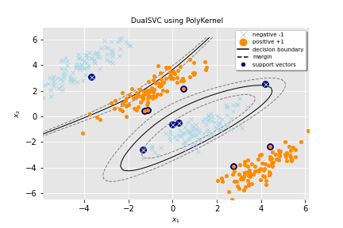

# OptiML
[](https://travis-ci.com/dmeoli/optiml) 
[](https://coveralls.io/github/dmeoli/optiml?branch=master) 
[](https://img.shields.io/badge/python-3.6%20%7C%203.7%20%7C%203.8%20%7C%203.9-blue) 
[](https://pypi.org/project/optiml/)
[](https://pypistats.org/packages/optiml)
[](https://mybinder.org/v2/gh/dmeoli/optiml/master)

OptiML is a sklearn compatible implementation of *Support Vector Machines* and *Deep Neural Networks*, 
both with some of the most successful features according to the state of the art.

This work was motivated by the possibility of being able to solve the optimization problem deriving from the mathematical 
formulation of these models through a wide range of optimization algorithms object of study and developed for the 
Numerical Methods and Optimization course  @ [Department of Computer Science](https://www.di.unipi.it/en/) @ 
[University of Pisa](https://www.unipi.it/index.php/english) under the supervision of prof. [Antonio Frangioni](http://pages.di.unipi.it/frangio/).

## Contents

- Numerical Optimization
    - Unconstrained Optimization
        - Line Search Methods
            - 1st Order Methods
                - [x] Steepest Gradient Descent
                - [x] Conjugate Gradient
                    - [x] Fletcher–Reeves formula
                    - [x] Polak–Ribière formula
                    - [x] Hestenes-Stiefel formula
                    - [x] Dai-Yuan formula
            - 2nd Order Methods
                - [x] Newton
                - Quasi-Newton
                    - [x] BFGS
                    - [ ] L-BFGS
        - Stochastic Methods
            - [x] Stochastic Gradient Descent
                - [x] Momentum
                    - [x] Polyak
                    - [x] Nesterov
            - [x] Adam
                - [x] Momentum
                    - [x] Polyak
                    - [x] Nesterov
            - [x] AMSGrad
                - [x] Momentum
                    - [x] Polyak
                    - [x] Nesterov
            - [x] AdaMax
                - [x] Momentum
                    - [x] Polyak
                    - [x] Nesterov
            - [x] AdaGrad
            - [x] AdaDelta
            - [x] RMSProp
                - [x] Momentum
                    - [x] Polyak
                    - [x] Nesterov
            - [x] Schedules
                - Step size
                    - [x] Decaying
                    - [x] Linear Annealing
                    - [x] Repeater
                - Momentum
                    - [x] Sutskever Blend
        - [x] Proximal Bundle with [cvxpy](https://github.com/cvxgrp/cvxpy) interface to 
          [ecos](https://github.com/embotech/ecos), [osqp](https://github.com/oxfordcontrol/osqp), 
          [scs](https://github.com/cvxgrp/scs), [etc](https://www.cvxpy.org/tutorial/advanced/index.html#choosing-a-solver).
    - Constrained Quadratic Optimization
        - Box-Constrained Quadratic Methods
            - [x] Projected Gradient
            - [x] Frank-Wolfe or Conditional Gradient
            - [x] Active Set
            - [x] Interior Point
        - [x] Lagrangian Dual
        - [x] Augmented Lagrangian Dual

- Machine Learning
    - [x] Support Vector Machines
        - Formulations
            - Primal
            - Wolfe Dual
            - Lagrangian Dual
        - [x] Support Vector Classifier
            - Losses
                - [x] Hinge (L1 Loss) 
                - [x] Squared Hinge (L2 Loss) 
        - [x] Support Vector Regression
            - Losses
                - [x] Epsilon-insensitive (L1 Loss) 
                - [x] Squared Epsilon-insensitive (L2 Loss) 
        - Kernels
            - [x] Linear
                
                | SVC          | SVR          |
                |    :----:    |    :----:    |
                |  |  |
                
            - [x] Polynomial
                 
                | SVC          | SVR          |
                |    :----:    |    :----:    |
                |  |  |              
                
            - [x] Gaussian
                
                | SVC          | SVR          |
                |    :----:    |    :----:    |
                |  |  |
                
            - [x] Laplacian
              
                | SVC          | SVR          |
                |    :----:    |    :----:    |
                |  |  |
            
            - [x] Sigmoid
        - Optimizers (ad hoc)
            - [x] Sequential Minimal Optimization (SMO)
            - [x] QP solver with [qpsolvers](https://github.com/stephane-caron/qpsolvers) interface to 
            [cvxopt](https://github.com/cvxopt/cvxopt), [quadprog](https://github.com/rmcgibbo/quadprog), 
            [qpOASES](https://github.com/coin-or/qpOASES), [etc](https://github.com/stephane-caron/qpsolvers#solvers).
    - [x] Neural Networks
        - [x] Neural Network Classifier
        - [x] Neural Network Regressor
        - Losses
            - [x] Mean Absolute Error (L1 Loss)
            - [x] Mean Squared Error (L2 Loss)
            - [x] Binary Cross Entropy
            - [x] Categorical Cross Entropy
            - [x] Sparse Categorical Cross Entropy
        - Regularizers
            - [x] L1 or Lasso
            - [x] L2 or Ridge or Tikhonov
        - Activations
            - [x] Linear
            - [x] Sigmoid
            - [x] Tanh
            - [x] ReLU
            - [x] SoftMax
        - Layers
            - [x] Fully Connected
        - Initializers
            - [x] Xavier or Glorot (normal and uniform)
            - [x] He (normal and uniform)

## Install

```
pip install optiml
```

## License [](https://opensource.org/licenses/MIT)

This software is released under the MIT License. See the [LICENSE](LICENSE) file for details.
